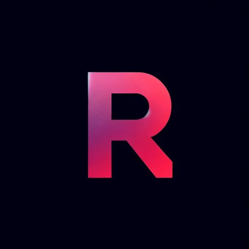

# Relictium
Relictium is an unofficial fork of [Vintagium (by Asek3)](https://github.com/Asek3/sodium-1.12), which is an unofficial fork of [CaffeineMC's “Sodium”](https://github.com/CaffeineMC/sodium), ported to version 1.12.2, and made to work with Forge Mod Loader.

# Warning

Relictium is not and never will be compatible with Optifine!